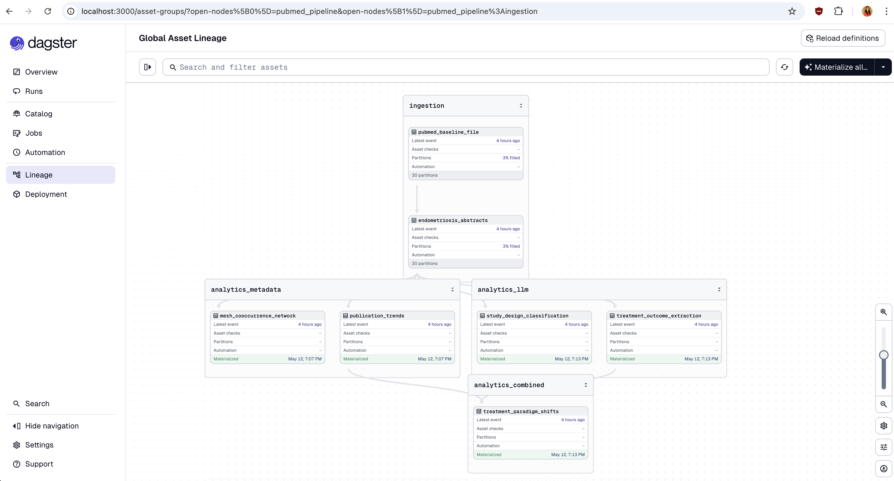
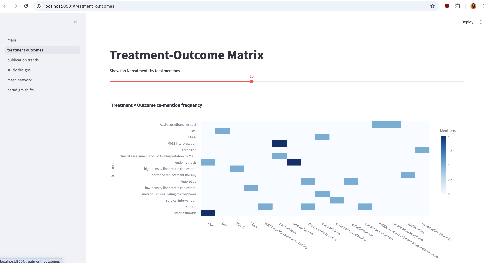
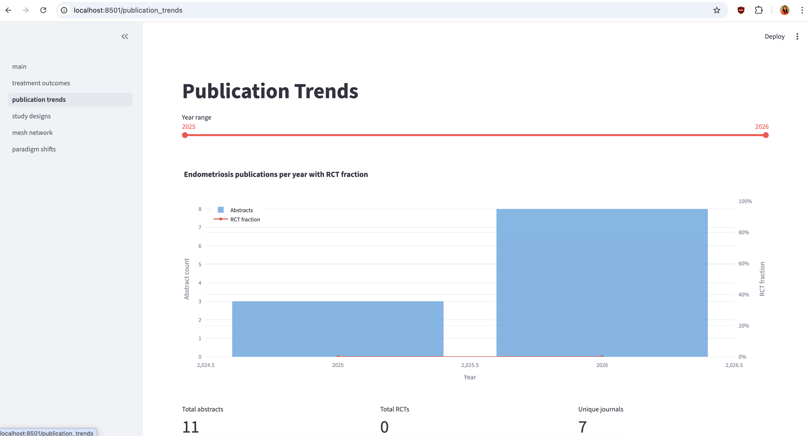
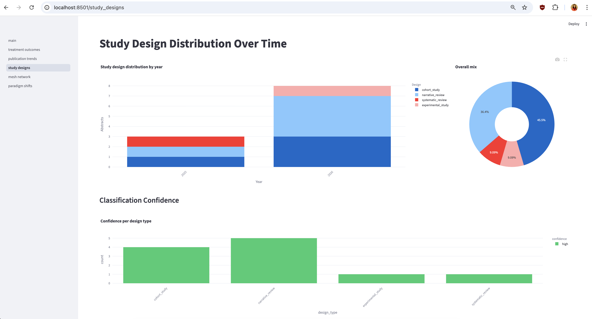
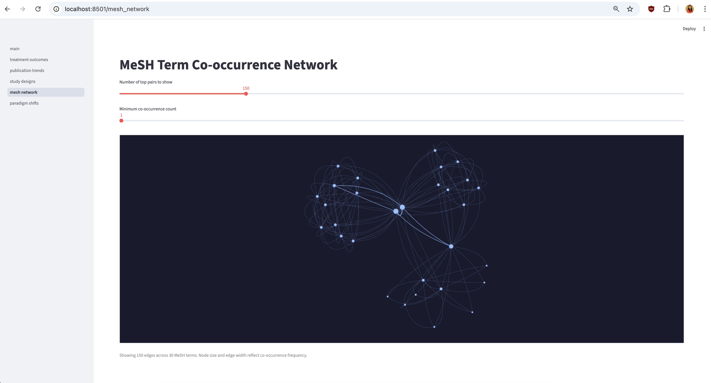
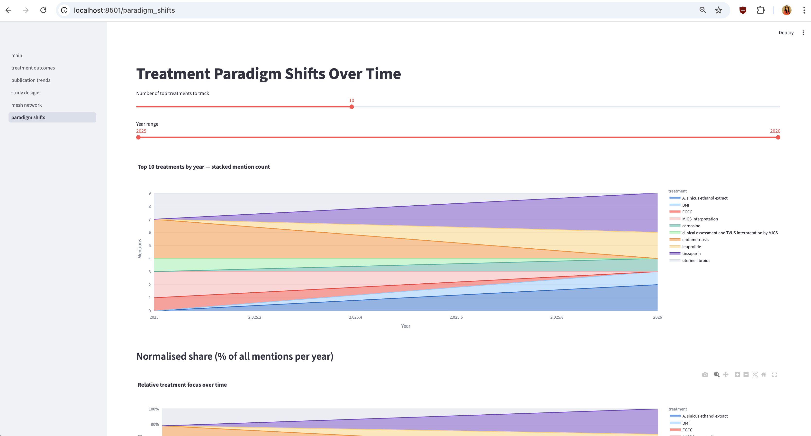

# PubMed Endometriosis Pipeline

End-to-end pipeline that ingests PubMed baseline XML, filters for endometriosis research, runs LLM extraction, and surfaces results in a Streamlit dashboard — orchestrated by Dagster, backed by PostgreSQL, containerised with Docker Compose.

---

## Quick start

```bash
cp .env.example .env
```

Set your Gemini API key and model in `.env`:

```env
LLM_MODEL=gemini/gemini-2.0-flash-lite
GEMINI_API_KEY=your_key_here
```

```bash
docker compose up
```

Once healthy, open **http://localhost:3000** (Dagster) and materialise assets from the Assets tab. Dashboard at **http://localhost:8501**.

> Running without a cloud API key? See [Running with local LLM](#running-with-local-llm-ollama) at the bottom.

---

## Architecture

```
PubMed FTP (baseline XML.gz)
        │
        ▼
pubmed_baseline_file        — download + MD5-verify one .xml.gz (partitioned)
        │
        ▼
endometriosis_abstracts     — parse XML, filter by MeSH/keyword, store in PostgreSQL
        │
        ├─────────────────────────────┐
        ▼                             ▼
treatment_outcome_extraction   study_design_classification
(LLM)                          (LLM)
        │                             │
        └────────────┬────────────────┘
                     │
        ┌────────────┼────────────┐
        ▼            ▼            ▼
publication_trends  mesh_cooccurrence_network  treatment_paradigm_shifts
(SQL)               (pair counting)            (LLM × timeline)
        │
        ▼
Streamlit Dashboard :8501
```

| Asset | Group | What it does |
|---|---|---|
| `pubmed_baseline_file` | ingestion | Downloads one `pubmed26nNNNN.xml.gz` from NCBI FTP, verifies MD5 |
| `endometriosis_abstracts` | ingestion | Streams XML with lxml, filters records, upserts to `abstracts` |
| `treatment_outcome_extraction` | analytics_llm | LLM extracts (treatment, outcome, efficacy_direction) triples |
| `study_design_classification` | analytics_llm | LLM classifies each abstract into one of 10 study design types |
| `publication_trends` | analytics_metadata | Yearly publication volume, RCT count, journal diversity |
| `mesh_cooccurrence_network` | analytics_metadata | MeSH term pair counts; stores top 5 000 co-occurrences |
| `treatment_paradigm_shifts` | analytics_combined | Treatment mentions over time; top 10 per year |

---

## Condition choice and filtering

**Why endometriosis** — a chronic condition affecting ~10% of reproductive-age women, significantly under-researched relative to its prevalence, with a rich PubMed literature spanning surgical, hormonal, and emerging biological treatments.

**Filter logic** (`utils/xml_parser.py`) — a record is kept if either:

1. **MeSH match** — `DescriptorName` contains `"Endometriosis"` (exact heading)
2. **Keyword match** — title + abstract contains any of: `endometriosis`, `endometrioma`, `adenomyosis`, `endometrial implant`

The MeSH check is the primary gate. The keyword fallback catches pre-indexed records and related terms.

**Corpus size** — the 2026 baseline spans 30 files (`pubmed26n1305` – `pubmed26n1334`), ~30 000 citations each. The pipeline is partitioned so you ingest one file per run. A single file typically yields 150–400 endometriosis abstracts.

---

## Prompt design

Both prompts share the same principles:

| Principle | Detail |
|---|---|
| **Role framing** | Opens with a biomedical extraction persona to steer domain-appropriate interpretation |
| **Strict output format** | `"Return ONLY a JSON array"` — no prose, no markdown, reliable parsing |
| **Concrete examples** | One-shot example in each prompt; without it, smaller models invent field names |
| **Fixed taxonomy** | Study design uses a closed 10-type list; ensures aggregations work without normalisation |
| **Zero temperature** | `temperature=0.0` — extraction is a recall task, not creative |
| **Resilient parsing** | Strips markdown code fences; JSON errors fall back to empty rather than failing the asset |
| **Rate-limit retry** | 3 retries at 10 s → 30 s → 60 s for transient cloud quota errors |

---

## Analytics design

| Analysis | Approach | Rationale |
|---|---|---|
| Treatment-outcome matrix | LLM extraction → relational table | No structured fields exist; free-text extraction is the only viable path at scale |
| Study design classification | LLM zero-shot | Avoids maintaining a regex rule set across 10 categories |
| Publication volume trends | Pure SQL `COUNT + GROUP BY year` | Structured metadata is available and accurate; no model needed |
| MeSH co-occurrence network | In-memory `Counter` over JSONB arrays | Fast, deterministic, captures semantic proximity without embeddings |
| Treatment paradigm shifts | SQL join windowed by year | Reveals which treatments dominated each era and when new ones emerged |

---

## Example output

### Dagster asset lineage



All seven assets materialised, grouped by layer: ingestion → analytics_llm / analytics_metadata → analytics_combined.

---

### Treatment-Outcome Matrix



Heatmap of treatment × outcome co-mention frequency. Each cell shows how often a pair appeared across abstracts.

---

### Publication Trends



Yearly volume with RCT fraction overlay. Metrics cards show total abstracts, RCTs, and unique journals.

---

### Study Design Distribution



Stacked bar by year and overall pie. Confidence scores per design type shown below.

---

### MeSH Term Co-occurrence Network



Force-directed graph of MeSH term pairs. Node size and edge width reflect co-occurrence frequency.

---

### Treatment Paradigm Shifts



Stacked area of top-10 treatment mentions per year, plus a normalised share view.

---

## Running with local LLM (Ollama)

No API key needed. Pulls `gemma3:4b` (~3.3 GB) on first run.

In `.env`:

```env
USE_LOCAL_LLM=true
```

```bash
docker compose -f docker-compose.yml -f docker-compose.llm.yml up
```
